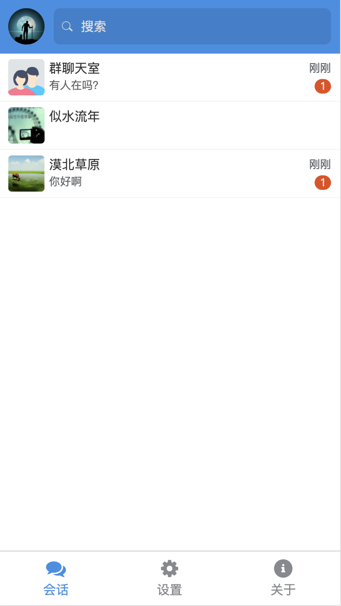
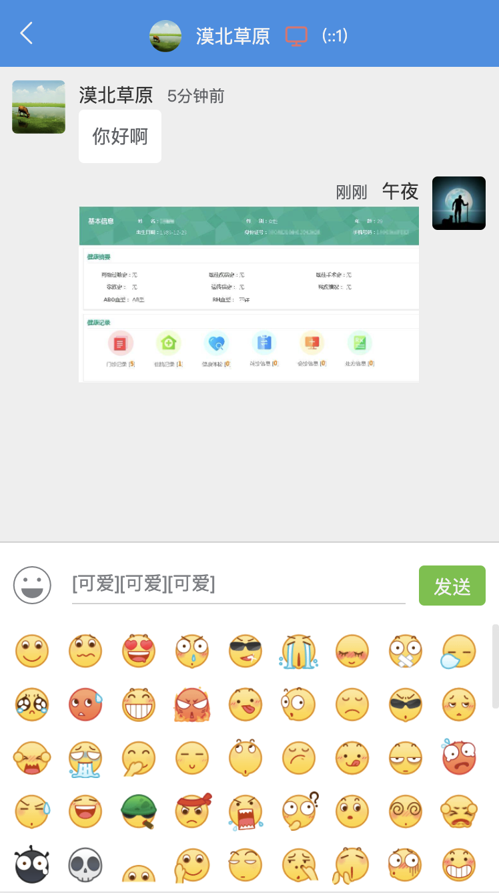
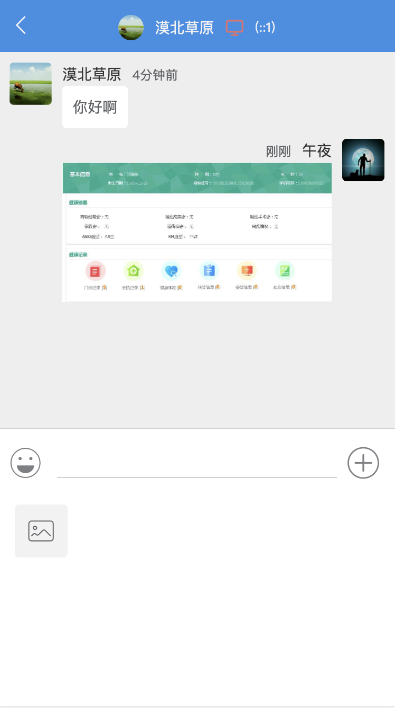

WebChat聊天室
---

WebChat聊天室是一个基于nodejs+express+socket.io模块构建的
网页聊天室工具。前端使用Vue作为前端框架。服务端使用express搭建web服务，使用socket.io
来创建服务端socket服务，实现了一些基本的聊天功能。

功能介绍
---
[✔]支持表情发送

[✔]支持键盘回车发送信息

[✔]支持在线用户统计和用户列表

[✔]支持在线用户搜索

[✔]支持在线用户的私聊

[✔]支持消息声音提示

[✔]支持消息显示设置

[✔]未读消息条数显示

[✔]支持发送小于1M的图片

[✔]支持移动端

相关技术站点
---
[Vue官方文档](https://cn.vuejs.org/v2/api/)

[Socket.io官方文档](https://socket.io/docs/)

使用手册
---
1. 下载代码并安装nodejs
2. 使用`npm install`安装项目依赖模块
3. 使用`npm run serve`启动开发服务
4. 使用`npm run prod`启动后台服务
5. 最后打开浏览器访问 `http://localhost:8080`
6. 开发完成后打包前端代码`npm run build`

项目预览截图
---

